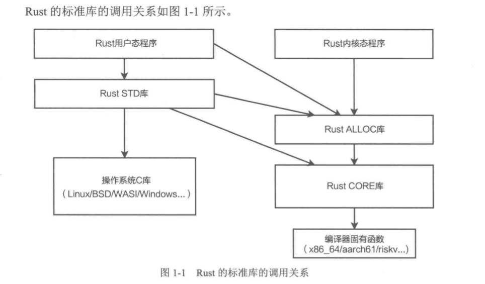

# Rust标准库体系概述

Rust被设计为能编写操作系统内核的系统级编程语言，使用静态编译，不采用GC（Garbage Collection）机制。

Rust标准库主要包括3个组件：

1. 语言核心库——CORE库
2. 智能指针库——ALLOC库
3. 用户态——STD库

## CORE

1. 编译器内置固有（intrinsic）函数

   编译器包括内存操作函数、数学函数、位操作函数、原子变量操作函数等。这些函数通常与CPU硬件架构紧密相关，

   且一般需要使用汇编代码来提供最佳性能。固有函数是由编译器实现的，提供给程序调用的函数，

   因此也实现了对不同CPU架构的适配

2. 基本特征（Trait）

   `CORE`库的基本特征包括运算符（OPS）Trait、编译器Maarker Trait、迭代器（Iterator）Trait、类型转换Trait等。

3. Option/Result类型

   `Option/Result`不是编译器的内嵌类型，与其他类型相比，也毫无特别之处，但它们通
   常被认为是Rust中不可或缺的语法组成部分。

4. 基本数据类型。
   CORE库的基本数据类型包括整数类型、浮点类型、布尔类型、字符类型和单元类型，
   重点对这些类型实现基本特征及一些特有函数。例如，字符类型实现了Unicode及ASCII
   不同编码的处理函数；整数类型及浮点类型实现了数学函数及字节序变换函数
5. 数组、切片及Range类型。
   CORE库的数组、切片及Range 类型包括对这些类型实现基本特征及一些特有函数。
6. 内存操作。
   CORE库的内存操作包括alloc模块、mem模块、ptr模块。Rust中90%的不安全(unsafe)
   语法都可归结到这3个模块，它们也是本书内容讲解的起点。
7. 字符串及格式化。
   CORE库的字符串及格式化包括对字符串类型实现基本特征及一些特有函数。在这些
   实现中，格式化需要重点关注。
8. 内部可变性类型。
   CORE库的内部可变性类型包括UnSafeCell<T>、Cell<T>、RefCell<T>等，同样对这些
   类型实现基本特征及一些特有函数。
9. 其他。
   CORE库的其他内容包括FFI、时间、异步库等。

## ALLOC

ALLOC库的所有类型都基于堆内存，包括智能指针类型、集合类型、容器类型。这些类型与为这些类型实现的函数和Trait组成了ALLOC库的主体。ALLOC库仅依赖于CORE库。LLOC库适用于OS内核编程与用户态编程。

ALLOC库的主要内容如下。

1. 内存申请与释放：AllocatorTrait及其实现者Global单元类型。
2. 基础智能指针类型：Box<T>、Rc<T>。
3. 动态数组智能指针类型：RawVec<T>、Vec<T>。
4. 字符串智能指针类型：String。
5. 并发安全基础智能指针类型：Arc<T>。
6. 集合类型：LinkList<T>、VecQueue<T>、BTreeSet<T>、BTreeMap<T>等。

## STD

建立在OS的系统调用（SYSCALL）基础上，只适用于用户态编程。STD库最主要的工作是针对OS资源设计Rust的类型、Trait及函数。

STD库的主要内容如下。

1. 对CORE库及ALLOC库的内容进行映射。
2. 实现进程管理与进程间通信。
3. 实现线程管理、线程间临界区/互斥锁、消息通信及其他线程相关内容。
4. 实现文件、目录及OS环境。
5. 实现输入、输出。
6. 实现网络通信。

